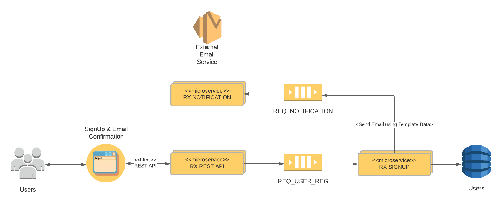

### 1. Install build tools
```
brew install protobuf
```

### 1. Create an environment
```
docker-compose up -d
```

#### 1.1 Create Kafka topics
```
docker exec -it poc-rx-kafka_kafka-1_1 bash
kafka-topics.sh --create --zookeeper zookeeper:2181 --replication-factor 3 --partitions 1 --topic req-user-reg --config min.insync.replicas=2
kafka-topics.sh --create --zookeeper zookeeper:2181 --replication-factor 3 --partitions 1 --topic req-notification --config min.insync.replicas=1
kafka-topics.sh --list --zookeeper zookeeper:2181
```

#### 1.2. Run migration scripts

Once you have run the command above ensure Cassandra has started successfully by checking the logs `docker logs -f eis_cassandra_1`. Once started run the following commands to create the database.  

```
docker cp ./poc-rx-signup/migration poc-rx-kafka_cassandra_1:/migration
docker exec -it poc-rx-kafka_cassandra_1 sh -c "cqlsh < /migration/changeset-2020-08-08-1-create-keyspace.cql"
docker exec -it poc-rx-kafka_cassandra_1 sh -c "cqlsh < /migration/changeset-2020-08-08-2-create-offset-storage.cql"
```

### 2. Compile & Run Notification Service
```
cd poc-rx-notification/
mvn clean install
java -jar ./poc-rx-notification-boot/target/poc-rx-notification-boot.jar
```

Use url http://localhost:8082/eis/status to check the status of the service. You should get an `OK`

### 3. Compile & Run Signup Service
```
cd poc-rx-signup/
mvn clean install
java -jar ./poc-rx-signup-boot/target/poc-rx-signup-boot.jar
```

Use url http://localhost:8081/eis/status to check the status of the service. You should get an `OK`

### 4. Compile & Run Rest API
```
cd poc-rx-rest/
mvn clean install
java -jar ./poc-rx-rest-api/target/poc-rx-rest-api.jar
```

Use url http://localhost:8080/eis/status to check the status of the service. You should get an `OK`